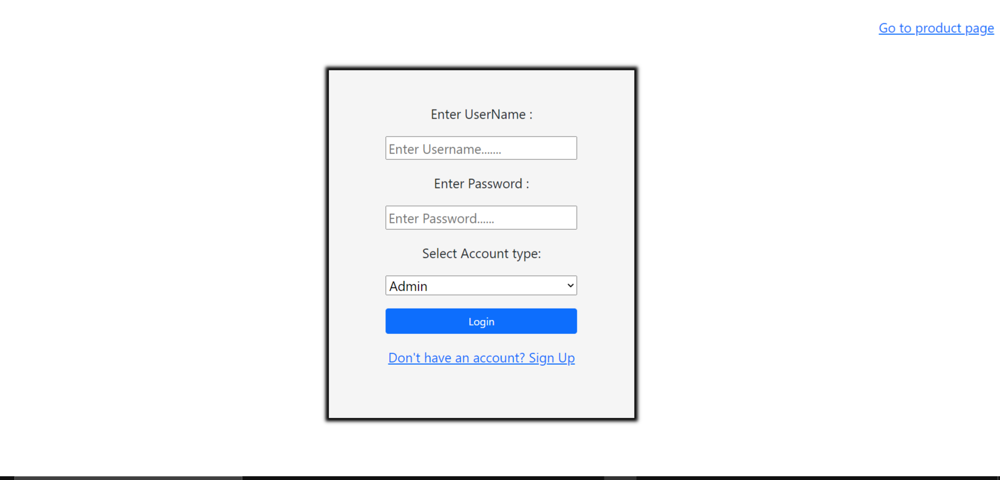
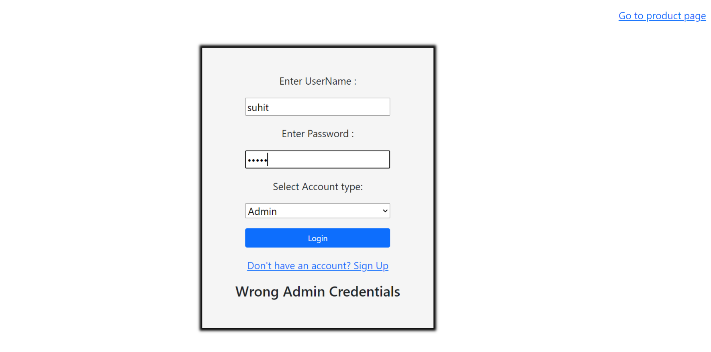
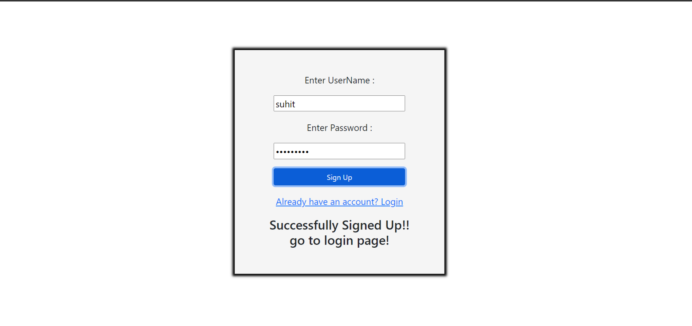
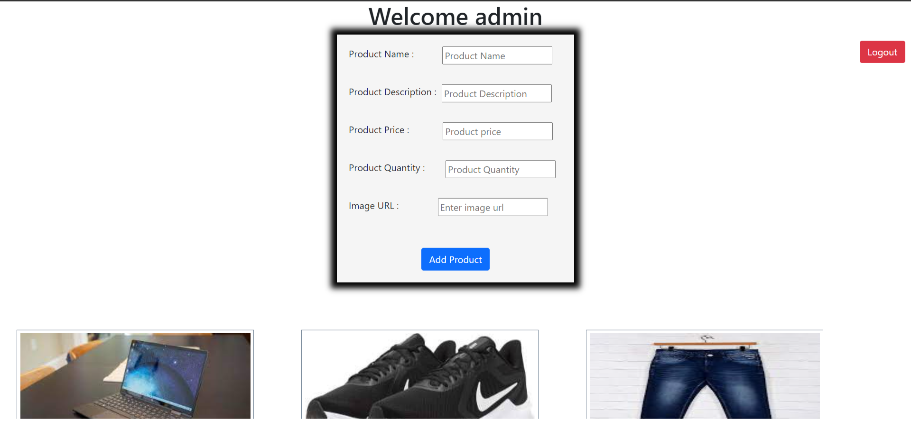
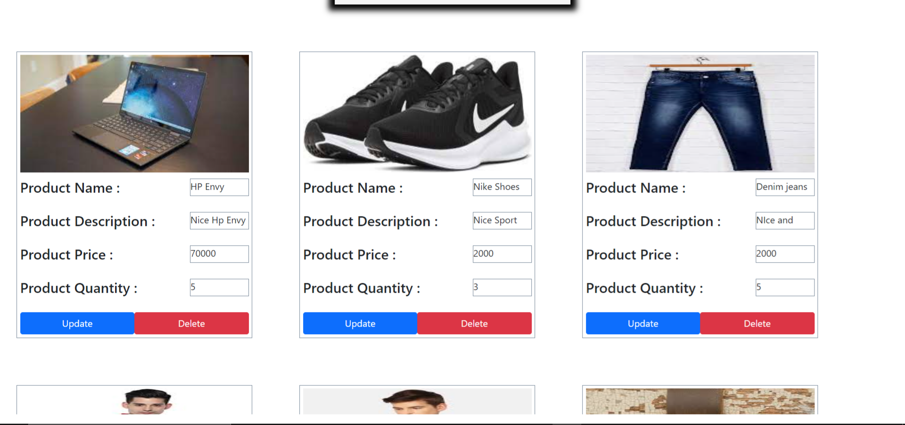
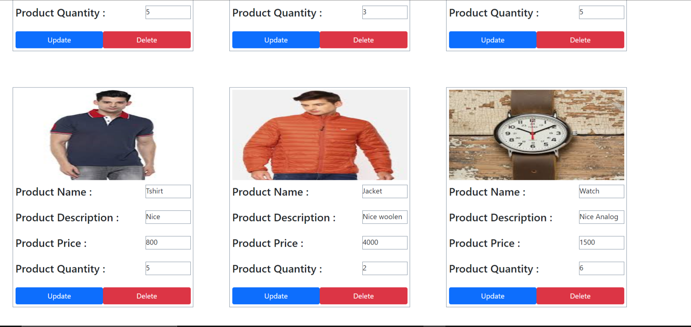
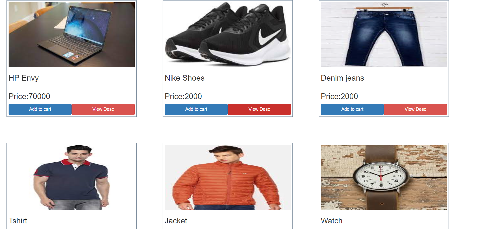
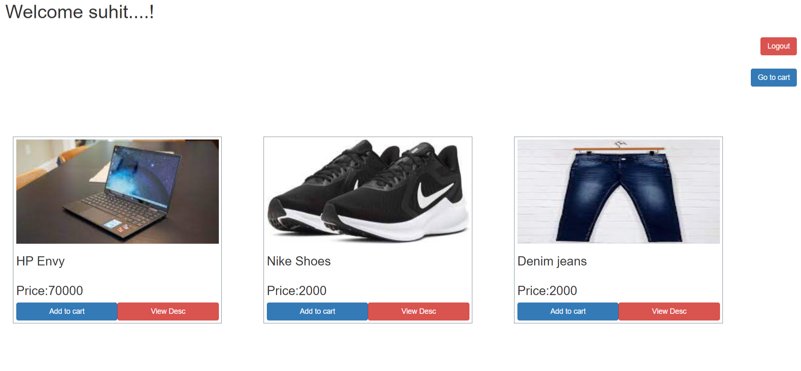
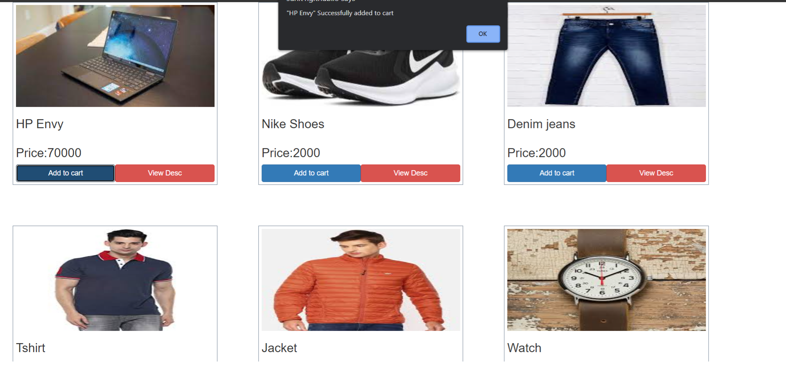
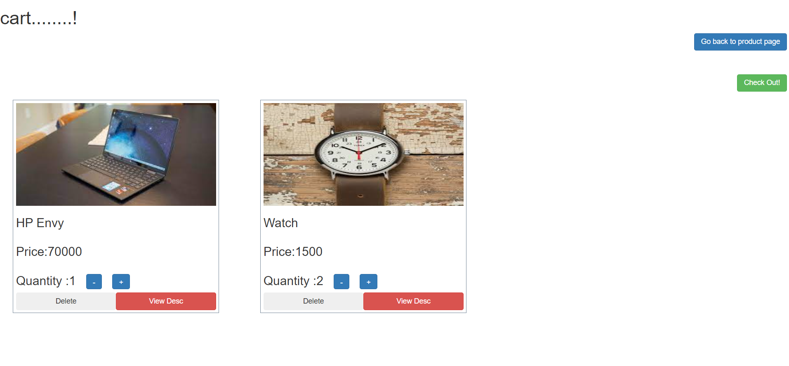

# E-commerce

1.  Its an E-commerce website where an admin can do the CRUD operations.
2.  In this site customers can view the product page directly without loging in but if they want to add something to their cart then they have to login first.
3.  cutomers can view the description of products a modal box will appear on the screen.
     
4.  I have used Bootstrap,javascript,html,css to build this website

#Screen Shots

Login Page

Login Page With if you enter wrong credentials

SignUp Page

Admin Page

Product Page

When User Log In

When User Add To Cart

User Cart

